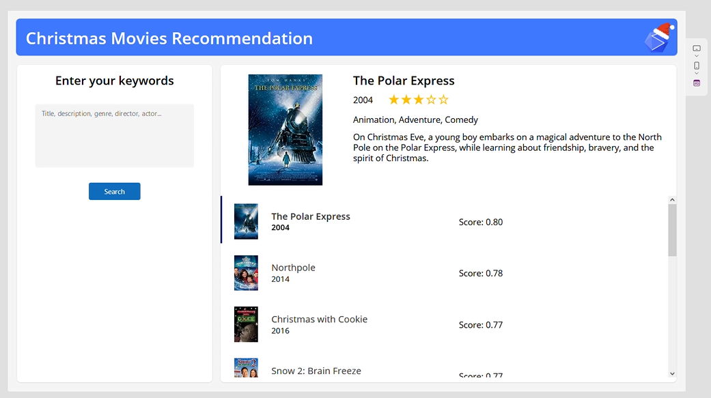

# Overview

This tutorial is the grand finale of our advent calendar, and we're wrapping things up by using a [Kaggle dataset](https://www.kaggle.com/datasets/jonbown/christmas-movies) packed with over 700 fantastic Christmas movies.

We're going to explore how to build a recommendation system. Whether you're a movie buff looking for new holiday favorites or a coding enthusiast eager to try something fun, this tutorial is here to help you out.

We'll walk through the steps together, learning how to transform your data, store it , and create a simple interface. By the end, you'll have the skills to make your own awesome holiday movie search engine and save some time to everyone looking for that perfect movie night.

